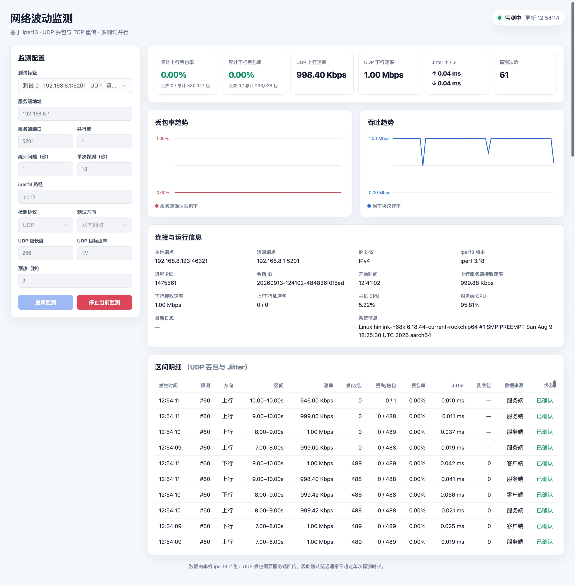

# iperf3-tool

这是一篇我被游戏被丢包整奔溃后，用codex做了一个检测网络质量工具的故事。

基于 Go 和网页界面的 iperf3 网络波动监测工具，重点用于观察 UDP 丢包、Jitter
以及 TCP 吞吐、重传和 RTT 等指标。工具调用运行机器上已经安装的 iperf3，将
实时 JSON 流解析后通过网页展示。

> 运行时不包含 iperf3。请先在运行本程序的机器上安装 iperf3，并确认命令可以
> 在终端中执行。iperf3 的安装和跨平台适配不由本项目负责。

## 功能

- UDP 丢包率、丢包数、总包数、Jitter、乱序包和吞吐实时展示。
- TCP 吞吐、重传、RTT、RTT 波动、拥塞窗口、PMTU 和拥塞算法展示。
- UDP、TCP 两种协议独立保存数据，切换协议不会混用或覆盖另一种协议的历史。
- 双向同时测试、单向上传、单向下载三种测试方向。
- 一个网页中可同时运行多个服务端或端口测试，并通过测试标签切换查看。
- 服务端地址支持 IPv4 和 IPv6，由 iperf3 自动识别地址族。
- 实时 SSE 推送，不需要轮询刷新页面才能看到区间数据。

## 使用截图

双向 UDP 速率、累计丢包率、 丢包数、总包数、Jitter、连接信息和区间明细。截图中的地址、端口以及监测数据仅用于演示。

## 快速开始

### 1. 准备 iperf3 服务端

#### 下载地址

- [iperf3 官方网站与文档](https://software.es.net/iperf/)
- [iperf3 官方源码仓库](https://github.com/esnet/iperf)
- [iperf3 官方源码包下载](https://downloads.es.net/pub/iperf/)
- [Windows 构建版](https://github.com/ar51an/iperf3-win-builds/)

ESnet 官方主要提供源码和文档，不直接维护 Windows 二进制安装包。Windows 用户
可以使用上面的 Windows 构建版，并根据其发布说明选择合适的版本。安装完成后，
请确认运行本项目的机器能够直接执行 `iperf3` 或 `iperf3.exe`。

在服务端机器上运行：

~~~bash
iperf3 -s -p 5201
~~~

如果服务端已经由系统服务、容器或其他进程启动，请确认它监听的地址和端口，
并允许来自客户端机器的 TCP 控制连接和 UDP 测试流量。

### 2. 启动本项目

开发运行：

~~~bash
go run .
~~~

或先编译再运行：

~~~bash
go build -o iperf3-tool .
./iperf3-tool
~~~

启动后访问：

- 本机：<http://localhost:8088/>
- 局域网：<http://运行机器的局域网IP:8088/>

网页中选择“新增标签”，填写服务端地址、端口和检测参数，然后点击“开始监测”。

## 默认配置

| 配置项 | 默认值 | 说明 |
| --- | ---: | --- |
| 服务端地址 | 127.0.0.1 | iperf3 服务端地址 |
| 服务端端口 | 5201 | iperf3 控制端口 |
| 检测协议 | UDP | 每个标签只运行一种协议 |
| 测试方向 | 双向同时 | 同时测试上行和下行 |
| UDP 目标速率 | 1M | UDP 每方向目标速率 |
| UDP 包长度 | 256 字节 | 更接近小包实时业务场景 |
| 统计间隔 | 1 秒 | iperf3 区间统计间隔 |
| 单次探测 | 10 秒 | 每次 iperf3 会话的持续时间 |
| 预热 | 3 秒 | 忽略会话开始阶段的预热数据 |
| 并行流 | 1 | iperf3 并行流数量 |
| iperf3 路径 | iperf3 | 命令名或可执行文件绝对路径 |

这些值适合快速暴露网游、实时语音等小包业务中的弱网问题。实际网络带宽较高
时，可以在网页中提高 UDP 目标速率；提高速率会增加网络和服务端负载。

## 指标说明

### UDP

- 上行：本机发送，服务端接收。丢包率和 Jitter 以服务端回传的区间结果为准。
- 下行：服务端发送，本机接收。客户端可以实时得到接收方向的丢包统计。
- 累计丢包率按“累计丢失包数 ÷ 累计总包数”计算，不是各区间百分比的简单平均。
- 由于上行结果需要服务端回传，部分上行丢包数据会在一次探测结束后确认。
- “—”表示当前方向还没有可确认的数据，不代表丢包率为零。

### TCP

TCP 由协议栈负责可靠传输，因此页面不显示 UDP 意义上的丢包率。TCP 页面重点
显示重传、吞吐、RTT、RTT 波动、拥塞窗口和 PMTU。不同系统或 iperf3 版本可能
不会提供全部内核字段，无法取得的指标会显示为“—”。

## iperf3 参数映射

程序会为每次探测启动一个本机 iperf3 客户端进程。典型 UDP 双向命令等价于：

~~~text
iperf3 -c <host> -p <port> -u -b <bitrate> -l <packet-length>
       -t <probe-duration> -i <interval>
       --json-stream --forceflush --get-server-output
       --udp-counters-64bit --bidir -O <omit-seconds>
~~~

不同方向和 TCP 模式会根据网页配置增加或省略对应参数。程序不会拼接 shell 字符串，
而是直接传递参数，服务端地址、路径等配置不会通过 shell 再解释。

## 构建与发布

项目当前使用 Go 1.26，前端构建使用 Node.js/npm。普通使用者运行发布包时只
需要发布的 Go 二进制和目标机器上的 iperf3。

推荐使用 Task：

~~~bash
task targets
task package TARGETS=darwin/arm64 VERSION=v1.0.0
task package TARGETS=windows/amd64,linux/amd64 VERSION=v1.0.0
~~~

注意：TARGETS 是变量，不是位置参数。下面这种写法是不正确的：

~~~bash
task package linux/arm64
~~~

未安装 Task 时使用项目自带构建程序，功能相同：

~~~bash
go run ./cmd/build list
go run ./cmd/build package -targets linux/arm64 -version v1.0.0
~~~

可选目标、压缩格式、SHA-256 校验和以及前端构建细节见
[BUILDING.md](BUILDING.md)。

### 使用 GitHub Actions 手动发布

项目提供了 `.github/workflows/release.yml`。推送到 GitHub 后，在仓库的
`Actions` 页面选择“手动打包并发布 Release”，点击 `Run workflow`，然后填写：

- `version`：发布版本号，例如 `v1.0.0`。
- `targets`：要构建的目标，使用英文逗号分隔；默认构建项目支持的全部 6 个目标。
- `prerelease`：是否将本次发布标记为预发布版本。

工作流会自动构建前端、打包所选平台、生成 `checksums.txt`，并将 `dist` 中的压缩包
和校验文件上传到对应的 GitHub Release。工作流需要仓库的 `Contents: Read and write`
权限；仓库设置中的 Actions 权限应允许工作流创建和发布 Release。

## 开发

修改 Go 代码后，在项目根目录执行：

~~~bash
go test ./...
go vet ./...
go build ./...
~~~

修改 webui/src 中的前端源码后执行：

~~~bash
npm --prefix webui ci
npm --prefix webui run build
~~~

构建结果会更新 internal/web/assets，这些文件由 Go 的 embed 编译进最终二进制。
不要只修改生成后的 internal/web/assets 文件；前端源码的修改应保存在 webui/src。

项目目录职责：

~~~text
.
├── main.go                    # 程序入口、8088 监听和局域网地址日志
├── internal/monitor/model.go  # 配置、样本、汇总和快照模型
├── internal/monitor/manager.go# 单个标签的生命周期、历史和 SSE 发布
├── internal/monitor/hub.go    # 多标签并行调度、重复检查和原子替换
├── internal/monitor/runner.go # iperf3 参数构造、JSON 流和服务端结果解析
├── internal/web/              # HTTP API、SSE、网页和内嵌资源
├── webui/src/                 # Element Plus 前端组件源码
└── cmd/build/                 # 不依赖 Task 的跨平台构建工具
~~~

## HTTP API

| 方法 | 路径 | 作用 |
| --- | --- | --- |
| GET | /healthz | 健康检查 |
| GET | /api/tests | 获取全部测试标签 |
| POST | /api/tests/start | 校验并创建新标签 |
| DELETE | /api/tests?testId=test-1 | 停止并删除标签 |
| GET | /api/status?testId=test-1 | 获取标签完整快照 |
| GET | /api/config?testId=test-1 | 获取标签配置 |
| POST | /api/start?testId=test-1 | 提交配置并重新监测 |
| POST | /api/stop?testId=test-1 | 停止当前标签 |
| GET | /api/stream?testId=test-1 | 订阅实时 SSE 事件 |

请求体使用 JSON，配置字段包括 host、port、bitrate、intervalSeconds、
probeDuration、packetLength、parallelStreams、binaryPath、protocol、
bidir、reverse 和 omitSeconds。服务端会拒绝未知字段和不合法配置。

## 数据与安全边界

- 历史数据只保存在进程内存中，程序重启后清空，不会自动写入磁盘。
- Web 服务默认监听 0.0.0.0:8088，同一局域网设备可以访问。
- 当前版本没有账号、密码和权限管理，请只在可信网络中运行。
- 不建议直接将 8088 暴露到公网；如确需远程访问，应在带认证的反向代理后面使用。
- 程序可以启动和停止本机的 iperf3 进程，iperf3 路径应指向可信的可执行文件。
- 请不要在公开 Issue、日志或截图中提交包含内部地址、令牌或其他敏感信息的内容。

## 故障排查

### iperf3 返回错误：control socket has closed unexpectedly

表示 iperf3 与服务端之间的 TCP 控制连接被提前关闭。即使检测协议选择 UDP，
iperf3 仍然需要 TCP 控制连接。请检查服务端是否正在运行其他测试、5201 端口和
防火墙策略、服务端 iperf3 版本，以及双向模式是否被服务端支持。服务端忙时等待
上一次测试结束后再重试。

### iperf3 返回错误：the server is busy running a test

同一个 iperf3 服务端通常不能同时接受超出其能力的测试会话。停止其他客户端或
等待服务端释放会话后再启动。

### TCP 某些指标显示“—”

RTT 波动、拥塞窗口和 PMTU 依赖 iperf3、操作系统内核和网络栈提供字段。部分
平台或服务端版本不会返回这些字段，此时页面会保留缺失状态，不将其伪造为零。

## 贡献

欢迎提交 Issue 和 Pull Request。提交前请阅读 [CONTRIBUTING.md](CONTRIBUTING.md)，
安全问题请阅读 [SECURITY.md](SECURITY.md)。
